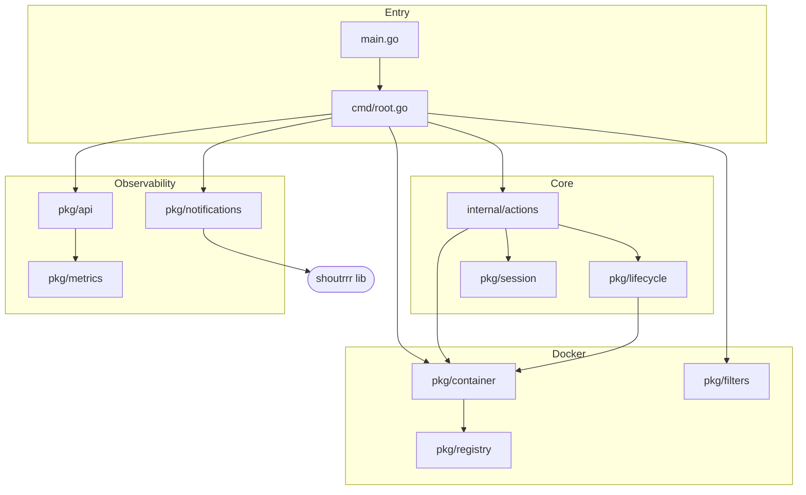
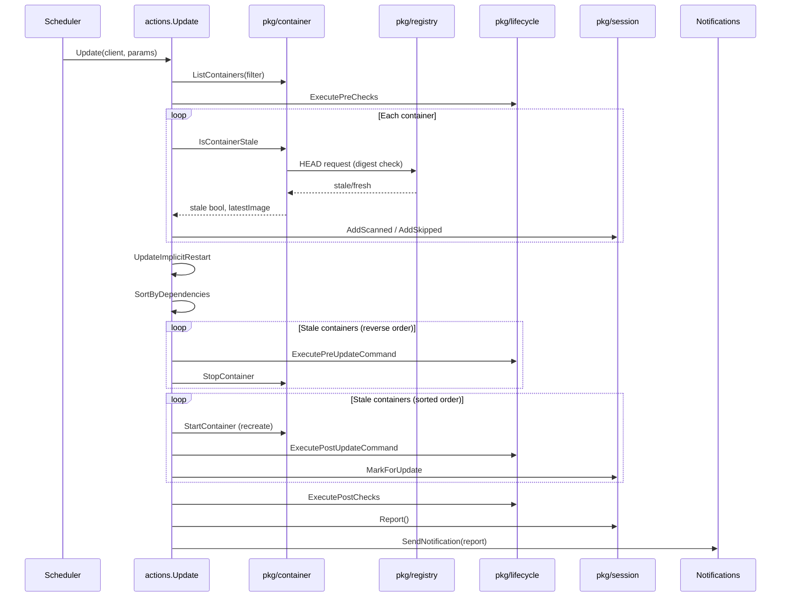

# Codebase Map

> Auto-generated by Cartographer. Last mapped: 2026-03-29

## System Overview

Watchtower is a Go daemon that watches running Docker containers and automatically recreates them when their image is updated. It polls registries, compares digests, and performs a stop → remove → recreate cycle while preserving the original container configuration.



---

## Directory Structure

```
watchtower/
├── main.go                         # Binary entry point (delegates to cmd)
├── cmd/
│   ├── root.go                     # Cobra root command, scheduler loop, all runtime orchestration
│   └── notify-upgrade.go           # Subcommand: migrate legacy notification flags to shoutrrr URLs
├── internal/
│   ├── actions/
│   │   ├── check.go                # Sanity checks: rolling-restart compat, multiple-instance cleanup
│   │   ├── update.go               # Core update loop: check staleness, stop, recreate, restart
│   │   └── mocks/                  # Test doubles: MockClient, container fixtures, progress fixtures
│   ├── flags/
│   │   └── flags.go                # All CLI flag registration, env-var binding, log setup, secrets
│   ├── meta/
│   │   └── meta.go                 # Version string + User-Agent header (set via ldflags)
│   └── util/
│       └── *.go                    # Slice/map set-subtraction utilities, random name/SHA generators
├── pkg/
│   ├── api/
│   │   ├── api.go                  # HTTP server with Bearer token auth, hardcoded :8080
│   │   ├── metrics/metrics.go      # /v1/metrics handler (Prometheus exposition)
│   │   └── update/update.go        # /v1/update handler (on-demand scan trigger)
│   ├── container/
│   │   ├── client.go               # Client interface + dockerClient impl (Docker SDK wrapper)
│   │   ├── container.go            # Container struct: wraps ContainerJSON + ImageInspect
│   │   ├── metadata.go             # All com.centurylinklabs.watchtower.* label constants
│   │   ├── cgroup_id.go            # Self-identification via /proc/{pid}/cgroup parsing
│   │   └── mocks/                  # ghttp mock server handlers and ContainerRef fixtures
│   ├── filters/
│   │   └── filters.go              # Composable container filter functions (name, label, scope, image)
│   ├── lifecycle/
│   │   └── lifecycle.go            # Executes pre/post-check and pre/post-update hook commands
│   ├── metrics/
│   │   └── metrics.go              # Prometheus metrics singleton (channel-based async updates)
│   ├── notifications/
│   │   ├── notifier.go             # Factory: builds shoutrrr notifier from cobra flags
│   │   ├── shoutrrr.go             # Core notifier: logrus.Hook + types.Notifier via shoutrrr
│   │   ├── common_templates.go     # Built-in named templates (default, porcelain.v1, json.v1)
│   │   ├── email.go                # Legacy SMTP → shoutrrr smtp:// URL converter
│   │   ├── slack.go                # Legacy Slack/Discord → shoutrrr URL converter
│   │   ├── msteams.go              # Legacy MS Teams → shoutrrr teams:// URL converter
│   │   ├── gotify.go               # Legacy Gotify → shoutrrr gotify:// URL converter
│   │   ├── templates/funcs.go      # Template function map (ToUpper, ToLower, Title, ToJSON)
│   │   └── preview/                # Template preview tool library + synthetic data generators
│   ├── registry/
│   │   ├── registry.go             # GetPullOptions, WarnOnAPIConsumption
│   │   ├── trust.go                # Auth resolution: env vars → Docker config file → credential store
│   │   └── auth/auth.go            # OCI bearer token challenge-response flow
│   └── session/
│       ├── container_status.go     # ContainerStatus type + State enum
│       ├── progress.go             # Mutable per-session accumulator (map of ContainerStatus)
│       └── report.go               # Progress → immutable Report (categorized, sorted)
├── tplprev/
│   ├── main.go                     # CLI binary for notification template preview
│   └── main_wasm.go                # WASM build: exposes tplprev to JavaScript
└── scripts/                        # Shell scripts for builds, tests, Docker utilities
```

---

## Module Guide

### Entry Point & CLI (`cmd/`)

**Purpose:** Bootstrap the application, parse all flags, and run the scheduler loop.

**Entry point:** `main.go` → `cmd.Execute()` → cobra `PreRun` → cobra `Run`

**Bootstrap sequence:**
1. `init()` in `main.go` sets default log level to Info
2. `cmd/root.go init()` calls `flags.SetDefaults()`, `flags.Register*Flags()`
3. Cobra `PreRun`: `flags.ProcessFlagAliases` → `flags.SetupLogging` → `flags.ReadFlags` → build `container.Client` and `notifier`
4. Cobra `Run`: build filter chain → `actions.CheckForSanity` → start HTTP API → start cron scheduler (or single run)

**Key design decisions:**
- Package-level mutable vars in `cmd/root.go` hold runtime state (client, notifier, etc.) — shared between `PreRun` and `Run`
- A `chan bool` (capacity 1) acts as a mutex preventing concurrent scans from the scheduler and the HTTP API
- `--interval` is normalized to `@every Xs` cron syntax by `ProcessFlagAliases`
- HTTP API port is hardcoded `:8080` (TODO comment exists)

**`notify-upgrade` subcommand:** Converts legacy flag-based notification config to shoutrrr URLs, writes them to a temp file at `/` for `docker cp` access, then auto-deletes after 5 minutes.

---

### Core Update Logic (`internal/actions/`)

**Purpose:** Orchestrate the container staleness check and update cycle.

**Key exports:** `Update(client, params) (Report, error)`, `CheckForSanity(...)`, `CheckForMultipleWatchtowerInstances(...)`

**Update flow:**
```
Update()
  ├── ListContainers + filter
  ├── ExecutePreChecks (lifecycle hooks)
  ├── For each container: IsContainerStale → add to Progress
  ├── UpdateImplicitRestart (propagate restart to linked containers)
  ├── SortByDependencies
  ├── [Normal mode]
  │     stopContainersInReversedOrder
  │     restartContainersInSortedOrder
  ├── [Rolling restart mode]
  │     performRollingRestart (one at a time)
  ├── ExecutePostChecks (lifecycle hooks)
  └── cleanup old images (deduplicated)
```

**Gotchas:**
- When the watchtower container itself restarts, it is renamed (random 32-char name) so the new instance can claim the original name
- `VerifyConfiguration` failure marks a container as skipped (not failed)
- Pre-update exit code `75` (EX_TEMPFAIL) skips the update without error

---

### Container Abstraction (`pkg/container/`)

**Purpose:** All Docker daemon interaction — listing, inspecting, pulling, stopping, starting, exec.

**Key interface:** `Client` (in `client.go`) — the sole boundary between watchtower logic and the Docker SDK.

**`Container` struct** wraps `types.ContainerJSON` + `types.ImageInspect`:
- `GetCreateConfig()` subtracts image-default env vars/labels/volumes before recreating (prevents accumulation)
- `GetCreateHostConfig()` normalizes legacy link format
- `Links()` merges Docker `--link`, `depends-on` label, and `container:` network mode sources
- Use `SafeImageID()` (not `ImageID()`) — `ImageID()` panics if `imageInfo` is nil

**Label namespace:** `com.centurylinklabs.watchtower.*` — all feature flags live here (enable, monitor-only, no-pull, scope, lifecycle hooks, stop signal, timeouts)

**Self-identification:** `GetRunningContainerID()` parses `/proc/{pid}/cgroup` — works only on Linux with cgroup v1.

**Network creation workaround:** `StartContainer` works around Docker issue #29265 — creates with one network, then individually disconnects/reconnects all networks.

---

### Registry & Auth (`pkg/registry/`)

**Purpose:** Digest-based staleness detection and credential resolution.

**Staleness check flow:**
1. `auth.GetToken` performs OCI bearer challenge-response against `/v2/` endpoint
2. HEAD request with bearer token fetches remote digest
3. Compare remote digest against local `ImageInspect.RepoDigests` — match = skip pull
4. On mismatch: `PullImage` (full pull); on HEAD failure: configurable warn strategy

**Auth resolution order:** `REPO_USER`/`REPO_PASS` env vars → Docker CLI config file (at `DOCKER_CONFIG` or `/`) → native credential helper (keychain, etc.)

**Gotchas:**
- Containers with pinned `sha256:` image refs are hard-rejected (cannot be updated)
- `WarnOnAPIConsumption` only warns for Docker Hub and `ghcr.io` under `WarnAuto` mode
- `DOCKER_CONFIG` defaults to `/` (not `~/.docker`) for containerized operation

---

### Container Filtering (`pkg/filters/`)

**Purpose:** Composable predicate chain to select which containers watchtower manages.

**Filter chain (built by `BuildFilter`):**
```
names filter → disable-names filter → enable-label (optional) → scope (optional) → disabled-label (always last)
```

**Key behaviors:**
- Name matching supports regex; Docker's leading `/` is stripped before comparison
- `FilterByEnableLabel`: opt-in mode — container must have the watchtower enable label
- `FilterByDisabledLabel`: always applied — containers with `enable=false` label are excluded
- Scope `"none"` is a sentinel matching containers without any scope label

---

### Lifecycle Hooks (`pkg/lifecycle/`)

**Purpose:** Execute user-defined shell commands inside containers at four hook points.

**Hook points:** pre-check, post-check, pre-update, post-update

**Execution:** `client.ExecuteCommand(containerID, command, timeoutMinutes)` — runs via `docker exec`

**Timeouts:** pre/post-check = 1 minute hardcoded; pre/post-update = from container labels (default 1 min, `0` = unlimited)

**Pre-update exit codes:**
- `0` — proceed with update
- `75` (EX_TEMPFAIL) — skip this container's update (not an error)
- anything else — error, container skipped with failure

---

### Session Tracking (`pkg/session/`)

**Purpose:** Track per-container state across a single update cycle and produce a final report.

**State flow:**
```
AddScanned → [MarkForUpdate] → [UpdateFailed] → Report()
                                                    ↓
                                            FreshState assigned here
                                            (old == new image ID)
```

**`Progress`** is a `map[ContainerID]*ContainerStatus` — mutable during the scan loop.

**`NewReport`** converts Progress into an immutable `types.Report` with all lists sorted by container ID. `All()` deduplicates using priority ordering (updated > failed > skipped > stale > fresh > scanned).

---

### HTTP API (`pkg/api/`)

**Purpose:** Expose Prometheus metrics and on-demand update trigger over HTTP.

| Route | Handler | Description |
|-------|---------|-------------|
| `GET /v1/metrics` | `promhttp.Handler` | Prometheus text exposition |
| `GET /v1/update` | `update.Handler.Handle` | Trigger on-demand scan; `?image=` for targeted updates |

**Auth:** All routes require `Authorization: Bearer <token>` — set via `--http-api-token`.

**Concurrency:** `/v1/update` shares the same `chan bool` lock as the cron scheduler. Targeted (`?image=`) updates block; untargeted updates skip if already running.

---

### Prometheus Metrics (`pkg/metrics/`)

**Registered metrics:**

| Metric | Type | Description |
|--------|------|-------------|
| `watchtower_containers_scanned` | Gauge | Containers scanned in last scan |
| `watchtower_containers_updated` | Gauge | Updated in last scan |
| `watchtower_containers_failed` | Gauge | Failed in last scan |
| `watchtower_scans_total` | Counter | Total scans since start |
| `watchtower_scans_skipped` | Counter | Skipped scans (nil metric = no containers changed) |

**Patterns:** Singleton `Default()` + buffered channel (cap 10) with a background goroutine consumer. `nil` metric = skipped scan (increments skipped counter, zeroes gauges).

---

### Notification System (`pkg/notifications/`)

**Purpose:** Send update summaries and log events to external services via shoutrrr.

**Architecture:**
```
CLI flags (--notification-url, --notifications email/slack/etc.)
    ↓
notifier.go: AppendLegacyUrls() converts legacy flags → shoutrrr URLs
    ↓
shoutrrr.go: shoutrrrTypeNotifier (logrus.Hook + types.Notifier)
    ↓
shoutrrr.Router.Send() → fan-out to all configured service URLs
```

**Notification lifecycle per scan:**
1. `StartNotification()` — opens log buffer
2. Update loop runs (log entries accumulate via logrus hook)
3. `SendNotification(report)` — renders template, sends asynchronously via `messages` channel

**Templates (built-in):**

| Name | Format |
|------|--------|
| `default` | Human-readable: count summary + per-container lines |
| `porcelain.v1.summary-no-log` | Machine-readable: one line per container |
| `json.v1` | Full JSON: report + log entries |
| `default-legacy` | Simple log line dump (pre-report era) |

**Supported services (via shoutrrr):** Slack, Discord, MS Teams, Email (SMTP), Gotify, plus any shoutrrr-native URL (`--notification-url`).

**Template preview tool (`tplprev`):** Standalone CLI (`tplprev/main.go`) and WASM build (`tplprev/main_wasm.go`) that renders templates against synthetic data. Used at [containrrr.github.io/watchtower/template-preview](https://containrrr.github.io/watchtower/template-preview).

---

## Data Flow: Container Update Cycle



---

## Conventions

- **Go version:** 1.21 (see `go.mod`)
- **Module path:** `github.com/arieffian/watchtower`
- **Test framework:** Ginkgo v1 (BDD) + Gomega matchers; some packages use `testify/assert`
- **Logging:** `logrus` with UTC JSON format
- **CLI:** Cobra + Viper; all flags have env-var equivalents via `viper.MustBindEnv`
- **Version injection:** `internal/meta.Version` set at build time via `-ldflags "-X ...Version=..."`
- **Docker label namespace:** `com.centurylinklabs.watchtower.*`

---

## Gotchas

1. **HTTP port hardcoded to `:8080`** — there's a TODO comment but no config knob yet
2. **`ImageID()` panics on nil imageInfo** — always use `SafeImageID()` in code that may encounter containers without image info
3. **`GetCreateConfig()` strips image-default values** — intentional to prevent env/label/volume accumulation across updates; non-obvious
4. **cgroup self-ID only works on Linux cgroup v1** — `GetRunningContainerID()` returns empty string silently on cgroup v2 or outside Docker
5. **`DOCKER_CONFIG` defaults to `/` not `~/.docker`** — intentional for containerized operation with mounted credentials
6. **`ContainsWatchtowerLabel` requires value `"true"`** — but other boolean labels use `strconv.ParseBool` (accepts `"1"`, `"TRUE"`, etc.), a subtle inconsistency
7. **`ProcessFlagAliases` FIXME: snakeswap** — `flags.Changed()` returns `false` for env-var-set values, so interval/schedule mutual-exclusion check manually compares against the hardcoded default
8. **Notification `messages` channel has capacity 1** — `SendNotification` blocks if a previous notification is still in flight (including its configured delay)
9. **WASM build bug in `tplprev/main_wasm.go` line 50** — `levelsArg` path passes `statesArg.String()` instead of `levelsArg.String()` to `LevelsFromString`
10. **`awaitDockerClient()` hardcoded 1-second sleep** — always runs at startup, not configurable

---

## Navigation Guide

**To add support for a new notification service:**
- If shoutrrr already supports it: just document the URL format, no code changes needed
- If adding a legacy flag-based adapter: add `pkg/notifications/<service>.go` implementing `ConvertibleNotifier`, register in `notifier.go:AppendLegacyUrls`

**To add a new container label:**
- Add constant to `pkg/container/metadata.go`
- Add accessor method to `pkg/container/container.go`
- Register the flag in `internal/flags/flags.go` if it needs a CLI equivalent

**To modify update behavior:**
- Core loop: `internal/actions/update.go`
- Pre/post hooks: `pkg/lifecycle/lifecycle.go`
- Container recreation config: `pkg/container/container.go` (`GetCreateConfig`, `GetCreateHostConfig`)

**To add a new HTTP API endpoint:**
- Add handler in `pkg/api/<name>/`
- Register in `cmd/root.go` via `api.RegisterFunc`

**To add a new Prometheus metric:**
- Add field to `pkg/metrics/metrics.go` `Metrics` struct using `promauto`
- Update `HandleUpdate` to set it from the `Metric` struct
- Update `NewMetric` in the same file to populate from `types.Report`
